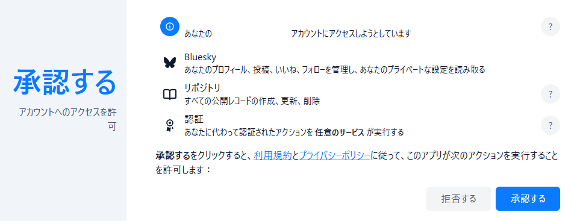
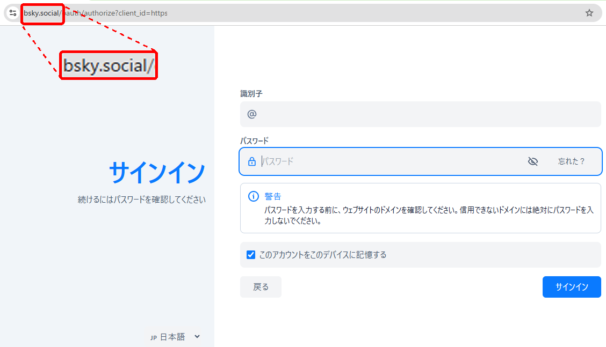
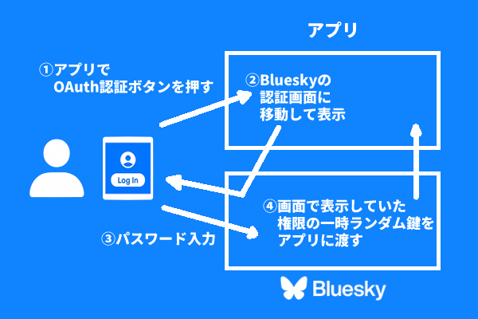

<b>※関係者レビュー中につき紹介はお待ちください</b>

---

Blueskyでは、公式以外のアプリを含むBlueskyアカウント（ユーザー）に対する認証方法を、今後 **「アプリパスワード」** から **「OAuth」** （オーオース）に変更していくことが予定されています。現在は両方の方式が混在しており、アプリパスワードは将来廃止することが検討されています。

> 参考：<a href="https://docs.bsky.app/blog/oauth-atproto" target="bsky">OAuth for AT Protocol（Bluesky公式アナウンスのひとつ）</a>

「認証」とは、パスワード入力などによって本人であることを証明することです。「ログイン」や「サインイン」のような言葉で目にしていると思います。

いくつかのアプリ・Webサービス（以降合わせてアプリと呼びます）では認証方法がアプリパスワードではなくOAuthになっています。しかし、認証画面の中でアプリに対して与える権限についての確認が表示されるため、不安になる方もいらっしゃるかと思います。

  

    
  

権限確認画面の例

しかし、OAuthはパスワード以上に安全な認証手段として世界中のアプリで利用されています。何らかのアプリを利用する際に、アプリ自体のパスワードではなく、「○○○でログイン」（○○○は例えばGoogleなど、アカウント管理をしているサービス）などの認証を目にする方も多いかと思いますが、それらは同じOAuthによるしくみです。

  

    
    
    
  

OAuthを使った認証を行うボタンの例

BlueskyにおけるOAuthとアプリパスワードの違いの概要は以下になります。

|比較要素|アプリパスワード|OAuth|
| --- | --- | --- |
| アプリに与える権限 | チャット（DM）に対する権限の有無は選択可能。それ以外は**全部**。 | 認証画面で表示される権限に**限定**。 |
| 入力パスワード | **アプリで参照**して、Blueskyに対して代理認証。 | **アプリでは参照不可**で、画面移動後の**Bluesky画面でパスワードを入力**して認証を行い、アプリに渡されるのは権限範囲の一時ランダム鍵のみ。 |
| アプリパスワードの無効化 | 可能 | -（アプリパスワード自体が存在しない） |

OAuth認証画面ではアプリに対して与える権限が表示されるため、必要以上に多くの権限を与えようとしていないかが不安になる方もいらっしゃると思います。しかし、逆にアプリパスワードでは表示されていないだけで、チャット（DM）に対する権限の有無が選択できる以外はアカウントで可能な操作すべての権限です。OAuthは権限が限定されていることを利用者が判断できるように、説明責任として提示しているだけなのです。

またパスワード入力について、Webブラウザでアドレスバー（URL欄）を見ていただくとわかるように、アプリ自身ではなくBluesky（`bsky.social`など）のドメインになっており、パスワード自体はアプリが関与することなくBlueskyによって処理されていることがわかるかと思います。

  

    
  

OAuth認証画面の例（画面上アドレスバーのドメインがBluesky公式のbsky.socialになっている）

  

    
  

OAuth認証の流れ（簡略版）

表示されている権限についても、現在Blueskyによって提供されているアプリから指定可能な選択肢が大まかであるため、アプリの機能範囲と一致していないように見えることがあります。これについては細かく権限範囲を指定できるよう継続的に改善されているところですので、今後より少ない権限範囲に限定されていく予定です。

もちろんOAuthだから絶対安全というわけではなく、Blueskyから与えられた権限の範囲でアプリはアカウントに対する操作ができますので、アプリ自体が信用できるかどうかは、アプリパスワード同様にご自身の判断になります。

しかし、上記のようにOAuthはアプリパスワードに比べて危険だったり信用できないことはありませんので、不安にならずご利用ください！